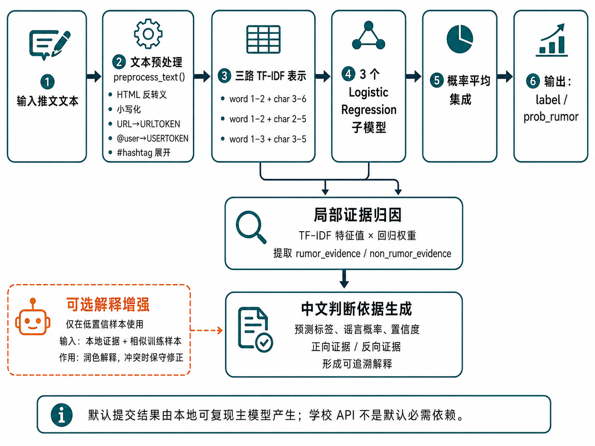
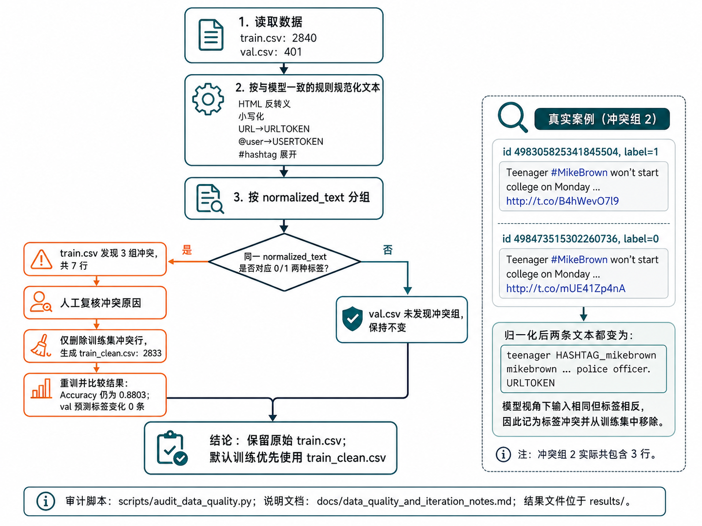
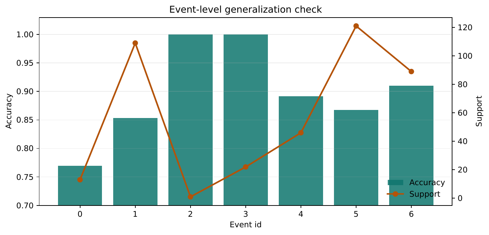
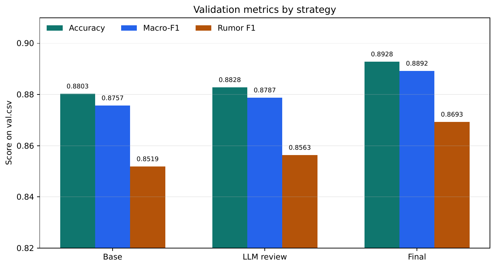
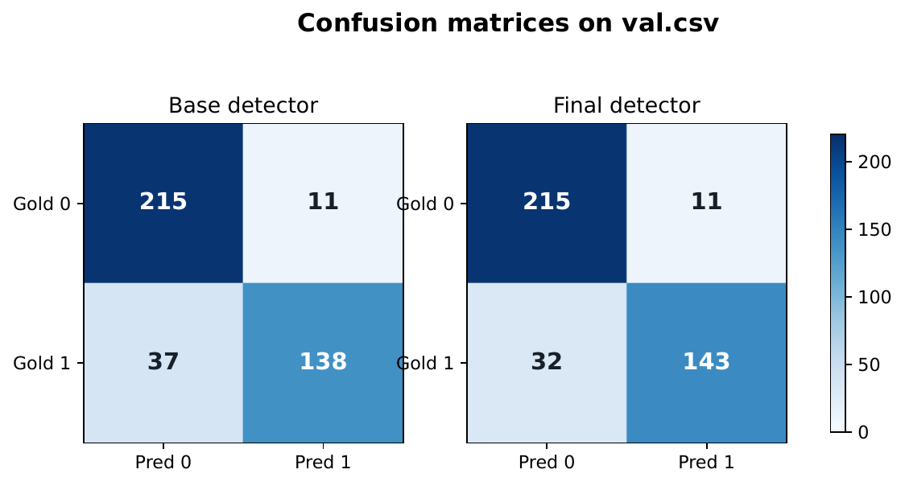
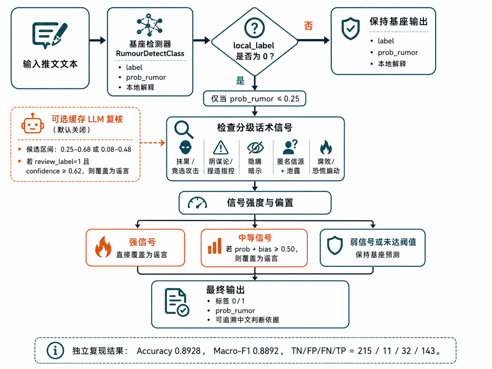
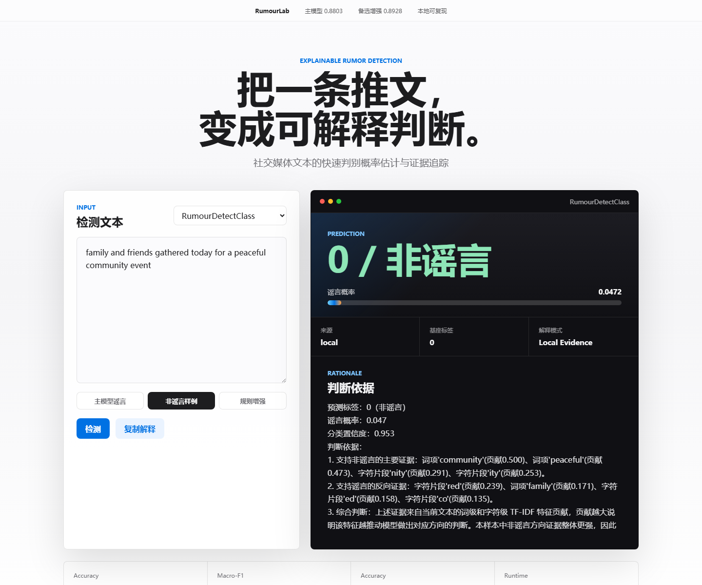
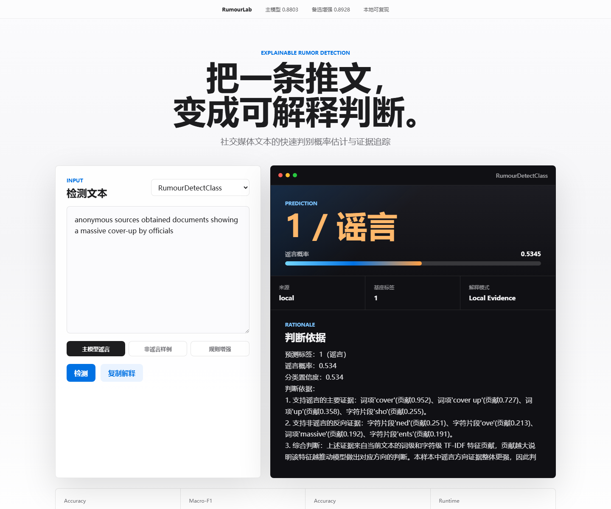
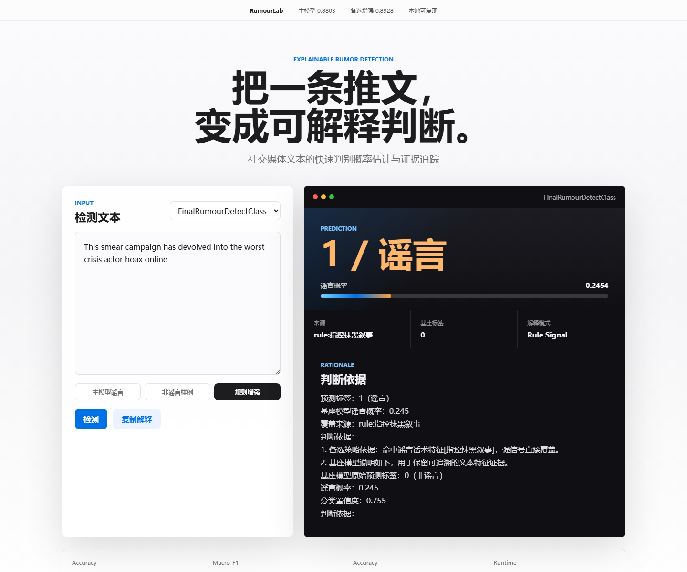

# 可解释的谣言检测

本项目完成《人工智能导论》大作业“可解释的谣言检测”：输入一条推文文本，输出二分类结果，其中 `0` 表示非谣言，`1` 表示谣言，并给出判断依据。项目包含本地可复现的 TF-IDF 集成检测器，以及可选的学校 API 大模型解释增强模块。

## 可视化概览

默认主线采用三路 TF-IDF + Logistic Regression 概率集成，并基于局部特征贡献生成中文判断依据；学校 API 与缓存结果只作为可选增强和探索记录。



## 项目结构

```text
.
├── rumer2026/
│   ├── train.csv
│   ├── train_clean.csv
│   └── val.csv
├── src/
│   ├── rumor_detector.py   # 核心检测类、预处理、解释生成
│   ├── llm_enhanced.py      # 学校API大模型增强检测与解释
│   ├── train.py            # 训练并保存模型
│   ├── evaluate.py         # 评估保存后的模型
│   ├── evaluate_llm.py      # 评估LLM增强模式
│   ├── final_detector.py    # 可选的分级信号+缓存LLM备选检测器
│   └── predict.py          # 单条文本预测
├── models/
│   └── rumor_ensemble.joblib
├── results/
│   ├── metrics.json
│   ├── event_accuracy.csv
│   ├── event_0_1_error_analysis.csv
│   ├── fn_recall_review_candidates.csv
│   ├── fn_recall_review_sweep.csv
│   ├── fn_recall_review_summary.json
│   ├── dev_threshold_experiment.csv
│   ├── cv_results.csv
│   ├── generalization_experiments_summary.json
│   └── val_predictions.csv
├── scripts/
│   ├── audit_data_quality.py
│   ├── run_generalization_experiments.py
│   ├── run_fn_recall_review_experiment.py
│   ├── run_rhetorical_feature_experiment.py
│   ├── run_final_detector_evaluation.py
│   ├── run_demo_server.py
│   └── build_report.py    # 使用 XeLaTeX 编译报告
├── demo/
│   ├── index.html          # 本地可视化演示页面
│   ├── styles.css
│   └── app.js
├── docs/
│   ├── data_quality_and_iteration_notes.md
│   ├── generalization_experiments.md
│   ├── fn_recall_review_experiment.md
│   ├── rhetorical_feature_experiment.md
│   ├── dense_embedding.md
│   ├── experiment_logs.md
│   └── llm_strategy_evolution.md
├── report.tex             # LaTeX 报告源文件
├── report.pdf
└── requirements.txt
```

## 环境安装

建议使用 Python 3.11。安装依赖：

```bash
pip install -r requirements.txt
```

## 复现路线

项目默认主模型不依赖学校 API 或本地缓存，可直接复现：

```bash
pip install -r requirements.txt
python -m src.evaluate --show-examples 0
```

预期输出：

```text
Accuracy: 0.8803
Macro-F1: 0.8757
Confusion matrix [[TN, FP], [FN, TP]]:
[[215  11]
 [ 37 138]]
```

如需从清洗训练集重新训练：

```bash
python -m src.train --with-explanations
python -m src.evaluate --show-examples 0
```

备选增强模型同样不依赖 ignored LLM cache，复现命令为：

```bash
python scripts/run_final_detector_evaluation.py
```

预期 Accuracy 为 `0.8928`，Macro-F1 为 `0.8892`，混淆矩阵为 `[[215, 11], [32, 143]]`。

## 报告编译

报告源文件为 `report.tex`，使用 LaTeX 编写。建议安装 TeX Live 或 MiKTeX，并使用 XeLaTeX 编译中文报告：

```bash
python scripts/build_report.py
```

也可以手动运行：

```bash
xelatex -interaction=nonstopmode -halt-on-error report.tex
xelatex -interaction=nonstopmode -halt-on-error report.tex
```

注意：课程要求 GitHub 中包含 `report.pdf`。本仓库保留 `report.tex` 作为源文件，提交前需要在已安装 XeLaTeX 的环境中运行上述命令生成并提交最新 `report.pdf`。

## 训练

在项目根目录运行：

```bash
python -m src.train --with-explanations
```

脚本会优先读取 `rumer2026/train_clean.csv`；如果该文件不存在，则回退到 `rumer2026/train.csv`。验证集始终使用原始 `rumer2026/val.csv`，训练后生成：

- `models/rumor_ensemble.joblib`：保存后的检测模型
- `results/metrics.json`：验证集指标
- `results/val_predictions.csv`：验证集预测结果和解释

## 数据质量审计

训练集中存在少量“当前预处理后文本相同但标签不同”的异常样本。可运行：

```bash
python scripts/audit_data_quality.py
```

脚本会生成：

- `results/train_preprocess_label_conflicts.csv`
- `results/val_preprocess_label_conflicts.csv`
- `results/data_quality_summary.json`
- `rumer2026/train_clean.csv`

详细发现和处理思路记录在 `docs/data_quality_and_iteration_notes.md`。

当前清洗策略是删除训练集中 3 组、7 行标签冲突样本，保留原始 `train.csv` 不动。清洗后训练集为 2833 条。本地模型在 `val.csv` 上的 Accuracy 仍为 0.8803，与原始训练结果一致；原始模型和清洗模型的验证集预测标签没有发生变化。



## 泛化与阈值实验

运行：

```bash
python scripts/run_generalization_experiments.py
```

脚本会生成：

- `results/event_accuracy.csv`
- `results/event_0_1_error_analysis.csv`
- `results/dev_threshold_experiment.csv`
- `results/cv_results.csv`
- `results/generalization_experiments_summary.json`

主要结论：

- 5-fold 交叉验证 Accuracy 为 `0.8641 ± 0.0176`，说明模型在训练集内部划分上较稳定。
- train 内部 dev 最佳阈值为 `0.51`，但应用到 `val.csv` 后 Accuracy 从 `0.8803` 降到 `0.8753`，因此最终保留默认阈值 `0.5`。
- 事件级分析显示 event 6 表现最好，Accuracy 为 `0.9101`；event 0 样本少且最难，Accuracy 为 `0.7692`。
- event 0 / event 1 的错误主要是 false negative：模型把部分真实谣言判为非谣言，说明后续优化重点应放在这些事件的谣言召回上。

详细记录在 `docs/generalization_experiments.md`。



## 低置信 False Negative 召回复核

事件级错误分析发现，event 0 / event 1 的主要问题是漏报谣言。为此新增一个定向复核实验：

```bash
python scripts/run_fn_recall_review_experiment.py
```

策略是只复核本地模型预测为 `0` 且 `0.20 <= prob_rumor < 0.50` 的样本；只有当 `deepseek-reasoner` 建议改为谣言且置信度不低于 `0.85` 时才覆盖。该实验生成：

- `results/fn_recall_review_candidates.csv`
- `results/fn_recall_review_sweep.csv`
- `results/fn_recall_review_summary.json`

当前结果：复核 79 条候选样本，最终只覆盖 1 条，救回 1 个 false negative，没有新增 false positive。Accuracy 从 `0.8803` 提升到 `0.8828`，Rumor F1 从 `0.8519` 提升到 `0.8554`。详细记录在 `docs/fn_recall_review_experiment.md`。

## 探索记录

`docs/dense_embedding.md`、`docs/experiment_logs.md`、`docs/llm_strategy_evolution.md` 和 `docs/rhetorical_feature_experiment.md` 记录了若干未进入最终主线的探索实验，包括稠密语义特征、event 特征、阈值扫描、L1 正则化、LLM Prompt 迭代和谣言话术辅助特征。话术特征实验表明，`anonymous+obtained`、`smear+campaign`、`hiding` 等模式更适合作为解释阶段的证据归纳，不适合作为直接覆盖标签的规则。默认可复现主线以当前 TF-IDF 集成模型和清洗训练集为准；保守 LLM 复核、高置信覆盖和分级话术信号作为附加实验记录。

## 评估

```bash
python -m src.evaluate --show-examples 3
```

默认提交模型在 `val.csv` 上的结果如下。该结果由 `RumourDetectClass` 对应的本地 TF-IDF 集成模型产生，是最容易复现、最适合作为课程主线提交的指标：

| 指标 | 数值 |
| --- | ---: |
| Accuracy | 0.8803 |
| Macro-F1 | 0.8757 |
| Rumor F1 | 0.8519 |

混淆矩阵 `[[TN, FP], [FN, TP]]` 为：

```text
[[215, 11],
[ 37, 138]]
```

<p align="center">
  
  
</p>

## 备选高召回方案

为探索更高的谣言召回率，项目还提供一个工程化的备选检测器 `FinalRumourDetectClass`。它默认不读取被 `.gitignore` 排除的 LLM 缓存文件，而是在默认本地模型之外使用可复现的分级谣言话术信号：

1. 先使用 `RumourDetectClass` 对输入文本给出基础概率和本地标签。
2. 仅针对本地模型判为非谣言且 `prob_rumor <= 0.25` 的低概率候选检查话术信号。
3. 强信号直接覆盖为谣言，中等信号采用 `prob_rumor + bias >= 0.50` 后再覆盖。

历史 LLM 缓存复核实验仍保留为显式可选功能，可在单条预测时增加 `--use-cache` 打开；默认复现口径不依赖该缓存。

单条预测：

```bash
python -m src.final_detector "input tweet text"
```

可选缓存实验：

```bash
python -m src.final_detector --use-cache "input tweet text"
```

验证集复现实验：

```bash
python scripts/run_final_detector_evaluation.py
```

在当前 `main` 基础上完成真实检测类封装后，默认规则版备选方案在 `val.csv` 上可独立复现到 `0.8928` Accuracy、`0.8892` Macro-F1，混淆矩阵为 `[[215, 11], [32, 143]]`。远程 `feat/rule-signal-system` 分支的独立后处理脚本曾记录 `0.9027` Accuracy，可作为附加探索结果说明；但该分数更依赖验证集缓存和后处理脚本形态，不作为最终默认主模型指标。默认课程主模型仍以 `RumourDetectClass` 和 `0.8803` Accuracy 为准，备选方案用于展示进一步提升召回率的探索过程。



## 单条文本预测

```bash
python -m src.predict "BREAKING: reports say the city confirms the story is false after investigation #news"
```

## 本地可视化演示

项目提供一个无额外前端依赖的本地 demo 页面，可用于课堂展示或报告截图：

```bash
python scripts/run_demo_server.py
```

然后打开：

```text
http://127.0.0.1:8000
```

页面支持选择默认主模型 `RumourDetectClass` 或备选增强模型 `FinalRumourDetectClass`，并展示标签、谣言概率、来源和中文判断依据。该演示只调用本地模型；学校 API 解释增强仍通过命令行模块单独运行。

<p align="center">
  
  
</p>

<p align="center">
  
</p>

## LLM 增强模式

先在 `.env` 中填写学校 API：

```env
SJTU_API_KEY=你的学校API_KEY
SJTU_BASE_URL=https://models.sjtu.edu.cn/api/v1
SJTU_MODEL=deepseek-reasoner
```

单条增强预测：

```bash
python -m src.llm_enhanced --force-llm "input tweet text"
```

全量验证时，推荐使用“低置信度复核 + 高置信覆盖”策略：

```bash
python -m src.evaluate_llm --low 0.30 --high 0.70 --allow-override --override-confidence 0.85 --quiet
```

该策略只对本地模型谣言概率位于 `[0.30, 0.70]` 的样本调用大模型。当前验证结果：

| 模式 | Accuracy | Macro-F1 | Rumor F1 | LLM调用 |
| --- | ---: | ---: | ---: | ---: |
| 本地TF-IDF集成 | 0.8803 | 0.8757 | 0.8519 | 0 |
| 低置信FN召回复核 | 0.8828 | 0.8784 | 0.8554 | 79 |
| LLM增强高置信覆盖 | 0.8828 | 0.8787 | 0.8563 | 70 |

默认增强模式不会让大模型随意改标签，而是优先使用本地模型标签，由大模型润色解释；只有当大模型与本地模型冲突且自评置信度不低于 `0.85` 时才覆盖。

输出示例：

```json
{
  "label": 1,
  "prob_rumor": 0.8598,
  "explanation": "预测标签：1（谣言）\n谣言概率：0.860\n分类置信度：0.860\n判断依据：\n1. 支持谣言的主要证据：...\n2. 支持非谣言的反向证据：...\n3. 综合判断：..."
}
```

也可以在代码中直接调用课程要求的检测类：

```python
from src.rumor_detector import RumourDetectClass

detector = RumourDetectClass("models/rumor_ensemble.joblib")
label = detector.classify("input tweet text")
reason = detector.explain("input tweet text")
```

如果需要运行备选高召回方案，也可以直接调用：

```python
from src.final_detector import FinalRumourDetectClass

detector = FinalRumourDetectClass("models/rumor_ensemble.joblib")
label = detector.classify("input tweet text")
reason = detector.explain("input tweet text")
```

## 方法说明

基础模型采用三路轻量线性集成：

- 词级 TF-IDF：捕捉关键词、二元词组和部分三元词组。
- 字符级 TF-IDF：提升对 hashtag、拼写变体、短文本片段的鲁棒性。
- 逻辑回归集成：平均三个互补模型的谣言概率，兼顾准确率、运行速度和可解释性。

基础解释模块计算当前文本中每个 TF-IDF 特征与逻辑回归权重的乘积，汇总为“支持谣言”和“支持非谣言”的局部证据。最终解释采用固定结构：预测标签、谣言概率、分类置信度、正向证据、反向证据和综合判断，便于评阅者检查依据的正确性与合理性。LLM 增强模块会把本地证据和相似训练样本发送给 `deepseek-reasoner`，让大模型生成更自然的中文判断依据，并在极少数高置信冲突样本上进行保守修正。

## 创新点

1. 多视角可解释集成：同时利用词级语义线索和字符级局部模式，再把各子模型的局部贡献合并为自然语言解释。
2. 平台特征保留式预处理：URL、用户提及、hashtag 不简单删除，而是归一化为可学习标记，降低短文本噪声。
3. 低置信度 LLM 复核：只让 `deepseek-reasoner` 处理不确定样本，兼顾解释质量、准确率和运行时间。
4. RAG 式相似样本提示：调用 LLM 时提供相似训练样本和本地模型证据，使解释更贴近数据集分布。

## 备注

暂无
